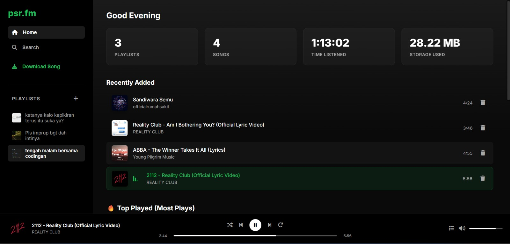

# 🎵 psr.fm

[](https://www.python.org/)
[](https://www.docker.com/)
[](LICENSE)
[]()

> **A lightweight, self-hosted music streaming server inspired by Spotify.**  
> Download, organize, and stream your favorite YouTube audio directly to your personal cloud.

---

## 📖 Description

**psr.fm** adalah aplikasi musik streaming **self-hosted** yang memungkinkan pengguna mengelola koleksi musik pribadi/podcast.

Dengan psr.fm kamu dapat:

- Download audio dari YouTube
- Mengubahnya menjadi MP3
- Membuat playlist
- Streaming musik melalui browser
- Melihat statistik pemutaran

psr.fm menggunakan sistem **Many-to-Many playlist**, sehingga satu file lagu dapat digunakan pada banyak playlist tanpa membuat duplikasi file.

---

## ✨ Features

### 🎧 YouTube Downloader
- Download audio menggunakan `yt-dlp`
- Convert menggunakan `FFmpeg`
- Output MP3 192kbps

### 📂 Smart Playlist
- Multiple playlist support
- Satu lagu bisa masuk banyak playlist
- Hemat storage

### 📊 Analytics
- Track waktu mendengar
- Statistik lagu favorit
- Play counter

### ⚡ Real-Time Download
- Live progress bar
- WebSocket powered
- Flask-SocketIO

### 🎵 Music Player

Support:

- Queue
- Shuffle
- Looping
- Repeat
- Next / Previous
- Keyboard shortcut

Shortcut:

| Key | Action |
|-|-|
| Space | Play / Pause |
| ← | Previous |
| → | Next |
| l | jump to loop start |
| esc | close popover |
---

## 🛠️ Tech Stack

| Component | Technology |
|-|-|
| Backend | Python 3.12 + Flask |
| Realtime | Flask SocketIO |
| Database | SQLite |
| Downloader | yt-dlp |
| Media | FFmpeg + Mutagen |
| Frontend | HTML CSS JavaScript |
| Deployment | Docker |

---

## 🚀 Installation

Clone repository:

```bash
git clone https://github.com/psr354/psr.fm.git

cd psr.fm
```

Create database:

```bash
touch database.db
```

Permission:

```bash
chmod 666 database.db

chmod -R 777 downloads
chmod -R 777 static/album_art
chmod -R 777 logs
```

Run Docker:

```bash
docker compose up -d --build
```

---

## 🌐 Access

Open browser:

```
http://localhost:5000
```

atau:

```
http://SERVER_IP:5000
```

---

## 📸 Preview

<p align="center">
  
</p>

---

## 📁 Structure

```text
psr_fm/
│
├── app.py
├── Dockerfile
├── docker-compose.yml
├── requirements.txt
├── database.db
│
├── services/
│   ├── database.py
│   ├── downloader.py
│   └── metadata.py
│
├── static/
│   ├── main.js
│   ├── style.css
│   └── album_art/
│
├── templates/
│   └── index.html
│
└── downloads/
    └── music library
```

---

## 🐳 Docker Commands

Start:

```bash
docker compose up -d
```

Stop:

```bash
docker compose down
```

Rebuild:

```bash
docker compose up -d --build
```

---

## 🤝 Contributing

Pull request sangat diterima.

```bash
git checkout -b feature/new-feature

git add .

git commit -m "Add new feature"

git push origin feature/new-feature
```

---

## 📜 License

MIT License

---

## 👤 Author

**psr354**

GitHub:

https://github.com/psr354

Project:

https://github.com/psr354/psr.fm

---

<p align="center">
Made with ❤️ and 🎵 by psr354
</p>
