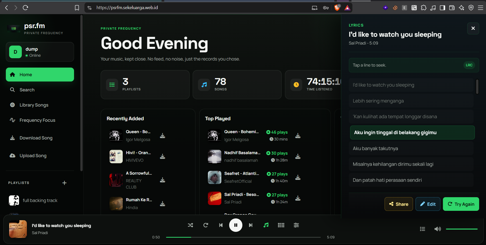

# 🎧 psr.fm

**Pemutar musik pribadi di server sendiri.**

<!-- Badge build dan version berikut adalah placeholder. Ganti saat CI dan rilis tersedia. -->


psr.fm adalah aplikasi musik self-hosted untuk menyimpan koleksi audio, membuat playlist, dan mendengarkan musik dari browser. Tambahkan lagu dari YouTube atau file lokal, lalu akses koleksimu lewat komputer maupun ponsel. Akun, playlist, dan riwayat dengar disimpan di server yang kamu kelola sendiri.



[Instalasi](#instalasi--setup) · [Penggunaan](#cara-penggunaan) · [Kontribusi](#berkontribusi) · [Kontak](#lisensi--kontak)

## ✨ Fitur Utama

- **Koleksi musik:** download dari YouTube/YouTube Music, pencarian audio lewat tautan track Spotify, dan upload file lokal.
- **Playlist pribadi:** cover, pengaturan urutan lagu, serta penambahan dari koleksi server tanpa download ulang.
- **Player:** queue, shuffle, repeat, A–B loop, dan equalizer 16-band.
- **Lirik:** lirik tersinkron jika tersedia, editor manual, dan gambar potongan lirik untuk dibagikan.
- **Offline:** simpan playlist di browser dan putar tanpa koneksi ke server.
- **Statistik:** lagu paling sering diputar, total waktu dengar, dan recap bulanan/tahunan melalui Frequency Focus.
- **Multi-user:** akun admin dan pengguna, dengan playlist serta riwayat dengar masing-masing.
- **Sinkronisasi listening:** antrean lokal dan retry saat koneksi pulih, dengan perlindungan terhadap pencatatan ganda.

## 🛠️ Tech Stack

| Komponen | Teknologi |
| --- | --- |
| Backend | Python 3.12, Flask, Flask-Login, Flask-SocketIO |
| Database | SQLite |
| Frontend | HTML, CSS, JavaScript, Web Audio API |
| Offline | Service Worker, Cache API, IndexedDB |
| Audio | yt-dlp, FFmpeg, Mutagen |
| Deployment | Docker, Docker Compose |

## Prasyarat

Untuk menjalankan aplikasi dengan Docker:

- **Git** untuk mengambil repository.
- **Docker** dengan **Docker Compose v2**. Docker Desktop dapat digunakan di Windows dan macOS.
- Koneksi internet untuk build pertama dan download lagu.
- Ruang penyimpanan untuk file audio dan database.
- Port **5000** yang tersedia.

Python dan FFmpeg sudah terpasang di image Docker. Node.js tidak diperlukan untuk menjalankan aplikasi; **Node.js 18+** hanya diperlukan jika ingin menjalankan tes JavaScript.

## 🚀 Instalasi & Setup

### 1. Clone repository

```bash
git clone https://github.com/Psr354/psr.fm.git
cd psr.fm
```

### 2. Siapkan konfigurasi

Salin file contoh:

```bash
cp .env.example .env
```

Di PowerShell, gunakan:

```powershell
Copy-Item .env.example .env
```

Buat secret key acak dengan Docker:

```bash
docker run --rm python:3.12-slim python -c "import secrets; print(secrets.token_hex(32))"
```

Buka `.env` dan ganti nilai `SECRET_KEY` dengan hasil perintah tersebut:

```dotenv
SECRET_KEY=<hasil-string-acak>
```

Pertahankan key yang sama saat restart atau update. Jangan masukkan `.env` ke Git.

### 3. Build dan jalankan

```bash
docker compose up -d --build
```

Docker akan memasang dependensi Python dan FFmpeg, lalu menjalankan aplikasi. Periksa statusnya:

```bash
docker compose ps
```

Buka **[http://localhost:5000](http://localhost:5000)**. Jika aplikasi berjalan di server lain, gunakan `http://<alamat-ip-server>:5000`.

### 4. Buat akun admin

Pada kunjungan pertama, halaman setup akan meminta username dan password. Akun pertama menjadi admin dan dapat menambahkan pengguna lewat **User Management**.

## Cara Penggunaan

### Tambahkan musik

1. Buat playlist melalui tombol **+** di sidebar.
2. Buka menu **Songs** dan pilih cara menambahkan lagu.
3. Pilih playlist tujuan, lalu mulai memutar lagu.

| Menu | Kegunaan | Batas |
| --- | --- | --- |
| **Download Song** | Tempel tautan YouTube, YouTube Music, atau track Spotify. | Maksimal 10 menit per lagu |
| **Upload Song** | Upload MP3, WAV, FLAC, OGG, atau M4A. | Maksimal 50 MB per file |
| **Library Songs** | Tambahkan lagu yang sudah tersedia di server. | Koleksi tersedia dari semua akun |

> Tautan Spotify digunakan sebagai metadata untuk mencari audio di YouTube Music/YouTube. Versi audio yang ditemukan dapat berbeda dari track Spotify.

### Gunakan player dan lirik

Klik lagu untuk memutar. Gunakan queue untuk menentukan urutan berikutnya, atau aktifkan shuffle dan repeat. Di ponsel, tekan lama lagu untuk membuka pilihan seperti **Play next** dan **Add to queue**.

Buka **Lyrics** untuk membaca lirik. Jika tersedia, baris lirik tersinkron dapat diketuk untuk berpindah posisi. Gunakan **Edit** untuk memperbaiki lirik atau **Share** untuk membuat gambar potongan lirik.

### Simpan playlist offline

Buka playlist saat terhubung ke server, pilih **Save Offline**, dan tunggu hingga selesai. Playlist tersimpan pada browser dan perangkat yang digunakan.

Fitur offline memerlukan browser yang mendukung Service Worker dan akses melalui **HTTPS** atau **localhost**. Riwayat offline akan disinkronkan ketika aplikasi dibuka dan server kembali tersedia. Menghapus data situs juga menghapus koleksi offline dan antrean yang belum tersinkron.

### Lihat recap

Buka **Frequency Focus** untuk melihat recap bulan atau tahun. **Most Played** menghitung berapa kali lagu mulai diputar; **Most Listened** menghitung total waktu yang didengarkan.

## Pengelolaan Aplikasi

### Perintah dasar

```bash
# Lihat log
docker compose logs -f psr_fm

# Restart aplikasi
docker compose restart

# Hentikan aplikasi
docker compose down

# Jalankan kembali
docker compose up -d
```

### Update

Backup data terlebih dahulu, lalu jalankan:

```bash
git pull
docker compose up -d --build
```

Migrasi database berjalan otomatis saat aplikasi mulai. Jika tampilan masih memakai versi lama, tutup tab atau aplikasi lalu buka kembali.

### Backup

Hentikan aplikasi sementara agar salinan database konsisten. Simpan `.env` beserta folder berikut:

| Folder | Data |
| --- | --- |
| `database.db/` | Akun, playlist, metadata, lirik, dan riwayat dengar |
| `downloads/` | File audio |
| `static/album_art/` | Cover lagu dan playlist |

Data tersebut disimpan di folder proyek melalui bind mount dan tetap ada setelah `docker compose down`.

### Pemecahan masalah

| Masalah | Pemeriksaan awal |
| --- | --- |
| Halaman tidak terbuka | Periksa `docker compose ps`, port 5000, alamat IP, dan firewall. |
| Download gagal | Periksa log dan ketersediaan sumber audio; coba tautan lain atau upload file lokal. |
| Login bermasalah setelah restart | Pastikan `.env` tersedia dan `SECRET_KEY` tidak berubah. |
| User Management tidak terlihat | Pastikan akun yang digunakan adalah admin. |
| Lirik tidak ditemukan | Tambahkan lirik melalui **Edit** di panel Lyrics. |

Untuk akses melalui internet, gunakan HTTPS dan reverse proxy. Konfigurasi Docker bawaan ditujukan untuk penggunaan lokal atau pribadi dan perlu disesuaikan sebelum deployment publik.

## Struktur Folder

```text
psr.fm/
├── app.py                  # Aplikasi Flask dan API
├── services/               # Database, download, metadata, dan lirik
├── static/                 # JavaScript, CSS, ikon, dan service worker
├── templates/              # Halaman HTML
├── scripts/                # Utilitas pengelolaan data
├── tests/                  # Tes backend dan player
├── downloads/              # File audio (dibuat saat runtime)
├── database.db/            # Database SQLite (dibuat saat runtime)
├── Dockerfile
├── docker-compose.yml
├── requirements.txt
└── .env.example
```

## 🤝 Berkontribusi

Bug report dan pull request dapat diajukan melalui GitHub. Untuk perubahan besar, buka issue terlebih dahulu agar cakupannya dapat dibahas.

1. Fork repository dan buat branch, misalnya `fix/listening-sync`.
2. Buat perubahan yang terfokus dan tambahkan tes jika mengubah perilaku aplikasi.
3. Jalankan pemeriksaan yang sesuai.
4. Buka pull request dengan penjelasan perubahan dan hasil pengujian.

Tes backend menggunakan container yang sudah berjalan:

```bash
docker compose exec -T psr_fm python -m unittest -q
```

Tes player dan antrean sinkronisasi dijalankan dari folder proyek dengan Node.js:

```bash
node --test tests/listening.test.mjs tests/listening-sync.test.mjs
```

Saat melaporkan bug, sertakan langkah reproduksi, perilaku yang diharapkan, serta log atau screenshot yang relevan. Hapus password, cookie, dan secret key dari lampiran.

## Lisensi & Kontak

**Lisensi:** repository ini belum menyertakan file `LICENSE`. Ketentuan penggunaan dan distribusi belum ditetapkan secara eksplisit; hubungi maintainer untuk konfirmasi.

- **Maintainer:** [psr354](https://github.com/Psr354)
- **Bug dan pertanyaan:** [GitHub Issues](https://github.com/Psr354/psr.fm/issues)
- **Kontribusi kode:** [Pull Requests](https://github.com/Psr354/psr.fm/pulls)
